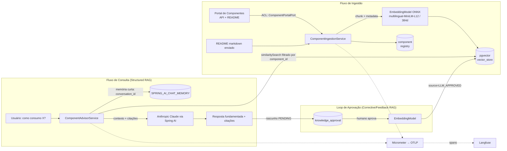

# PoC Agentic RAG — Component Advisor

Agente que ensina desenvolvedores a **consumir componentes internos** do portal.
Ele ingere as informações do componente (API + README), indexa no **pgvector**, e
responde "como implementar o consumo de X" com **citações das fontes**. Respostas
aprovadas por um humano viram base de conhecimento (loop _human-in-the-loop_).

> **Construção evolutiva/incremental.** Esta é a **Fase 1 (Structured RAG)**, já
> validada ponta a ponta. As fases 2–4 evoluem até o padrão _Agentic RAG_ sem jogar
> fora o que já existe. Veja [Roadmap](#roadmap-evolutivo).

**Stack:** Java 25 · **Spring Boot 4.0** (Spring Framework 7) · **Spring AI 2.0** ·
PostgreSQL + pgvector · Embeddings ONNX locais **multilíngues**
(paraphrase-multilingual-MiniLM-L12-v2, 384d) · Anthropic Claude · Langfuse v3 (OTLP).

---

## Status desta fase (verificado)

Rodado localmente contra Postgres+pgvector real e a app no perfil `mock`:

| Verificação | Resultado |
|---|---|
| Build (Spring Boot 4.0.7 + Spring AI 2.0.0, Java 25) | ✅ `BUILD SUCCESS` + 6 testes verdes |
| Flyway V1+V2+V3 no pgvector (PG 17) | ✅ extensões, `vector(384)`, HNSW, `sequence_id` (Spring AI 2.0) |
| `/advise` real com **claude-sonnet-5** (Boot 4) | ✅ funciona — Spring AI 2.0 não força mais `temperature` |
| Boot da app + health | ✅ `UP`, embeddings ONNX carregados |
| Ingestão do portal (`payments-sdk`) | ✅ 3 endpoints + 1 overview + 5 chunks README = 9 docs, 384 dims |
| Idempotência (re-ingest) | ✅ `skipped:true`, 0 docs |
| Recuperação PT (multilíngue) | ✅ "estornar" → endpoint de refund em 1º |
| Upload de README próprio | ✅ substitui fontes primárias, preserva o resto |
| Loop de aprovação (HITL) aprovar/rejeitar | ✅ aprovado vira `LLM_APPROVED` recuperável; rejeitado descartado |
| Testes (6) + CI | ✅ 2 unitários + 4 integração, `BUILD SUCCESS` |
| `/advise` — geração pela LLM (real, Sonnet 4.5) | ✅ resposta fundamentada com citações `[n]` |
| Memória de curto prazo (real) | ✅ acompanhamento lembra o turno anterior |
| Loop HITL com resposta real | ✅ aprovar → `LLM_APPROVED` recuperável |

---

## Arquitetura (Fase 1)



### As duas memórias (deliberadamente separadas)

| | Curto prazo | Longo prazo |
|---|---|---|
| O quê | Histórico da conversa | Conhecimento sobre componentes |
| Onde | `SPRING_AI_CHAT_MEMORY` (JDBC) | `vector_store` (pgvector) |
| Como | `MessageWindowChatMemory` (janela de 20 msgs) | busca por similaridade (HNSW/cosine) |
| Chave | `conversation_id` | filtro `component_id` + `source` |

Misturar as duas polui a recuperação; por isso são tabelas e mecanismos distintos.

---

## Decisões de engenharia (o porquê)

- **Arquitetura hexagonal leve.** O portal é externo e instável → isolado atrás de
  `ComponentPortalPort` (Anti-Corruption Layer). Trocar o portal ou mockar em teste
  não toca o domínio. Na Fase 4 essa mesma _port_ vira uma _tool_ do agente.
- **Structured RAG, não "naive".** A fonte primária é uma API com contrato: cada
  endpoint vira um documento com **metadados filtráveis** (`kind`, `endpoint`,
  `version`), o que melhora precisão e permite filtro por componente.
- **Embeddings locais multilíngues (ONNX, 384d).** A Anthropic **não tem API de
  embeddings**. Uso o `paraphrase-multilingual-MiniLM-L12-v2` (bom em PT-BR) localmente:
  zero chave externa, reprodutível e barato. Como tem a **mesma dimensão (384)** do MiniLM
  inglês, a troca **não exigiu migração de schema**. O **id do modelo entra no hash de
  idempotência** — trocar o modelo força a re-ingestão (re-embed), evitando misturar
  vetores de modelos diferentes na mesma tabela.
- **pgvector + HNSW/cosine.** Estado da arte para ANN em Postgres; um só banco para
  vetores + dados relacionais + memória de conversa reduz operação na PoC.
- **Flyway com DDL explícito.** `initialize-schema` do Spring AI **desligado**: schema
  versionado e revisável, pronto para produção (nada de DDL mágico em runtime).
- **Anti-eco no loop HITL.** Só respostas **aprovadas** entram na base, marcadas
  `source=LLM_APPROVED` e com **precedência menor** que `PORTAL_API`/`README`. Reingerir
  um componente **apaga só as fontes primárias** e **preserva** o conhecimento aprovado.
- **Idempotência por hash.** Reingestão sem mudança de conteúdo não recomputa embeddings.
- **Java 25 + virtual threads.** O caminho é I/O-bound (portal + DB + LLM); virtual
  threads dão concorrência barata sem programação reativa.
- **Observabilidade nativa.** Spring AI emite spans (Micrometer) exportados via **OTLP**
  para o **Langfuse** — cada recuperação e chamada de LLM fica rastreável.
- **Segurança.** `component_id` é validado (`[A-Za-z0-9._-]+`) antes de entrar em filter
  expression do vector store (evita injeção no filtro).

---

## Observabilidade e Qualidade (M03 — as 5 camadas)

A Fase 1 foi **instrumentada com as 5 camadas** do módulo _Observabilidade e Qualidade_ (M03),
**sem mudar o conceito** do Structured RAG. O plano completo (SLOs, KPIs, rúbrica e roteiro de
demo) está em **[docs/PLANO-OBSERVABILIDADE-QUALIDADE.md](docs/PLANO-OBSERVABILIDADE-QUALIDADE.md)**.

| Camada | O que foi aplicado | Onde |
|---|---|---|
| **1 · Observar** | spans enriquecidos (`gen_ai.*`, `rag.route/risk`), eventos (`ungrounded`, `low_confidence`, `user_feedback`), `traceId` no envelope | `ComponentAdvisorService` → OTLP/Langfuse |
| **2 · Técnica** | SLIs `rag.*` (latência p50/p95/p99, tokens, custo, erros por `model`/`route`), SLO por rota | `RagMetrics` → `/actuator/prometheus` |
| **3 · Qualidade** | guardrail anti-alucinação (determinístico) + LLM-as-judge (mock/llm) + golden set | `quality/*`, `golden/payments-sdk.csv` |
| **4 · Negócio** | CSAT 👍/👎 ligado ao trace, KPIs (canvas), north-star _time-to-first-successful-call_ | `FeedbackController` |
| **5 · Governança** | quality gate no CI ("O Portão"), roteamento por risco (alias→modelo) | `quality-gate.yml`, `RouteClassifier` |

Decisões registradas em ADRs: [docs/adr/](docs/adr/). Checklist de produção + evidências LGPD:
[docs/CHECKLIST-PRODUCAO.md](docs/CHECKLIST-PRODUCAO.md).

> **Roteamento e comportamento inalterados por default:** os três aliases de modelo
> (`app.routing.{strong,fast,default}-model`) apontam para o mesmo modelo; aponte `fast-model`
> para um modelo mais barato e o roteamento por custo entra em ação. O juiz de qualidade roda
> em **mock** por padrão (sem chave); `app.quality.judge=llm` liga o juiz real.
>
> **Seleção de modelo por chamada:** `GET /api/v1/models` lista os modelos aceitos (catálogo
> versionado em `app.models` + descoberta ao vivo da conta); passe `model` no `POST /advise`
> para escolher — ele tem precedência sobre o roteamento. Ver [ADR-0006](docs/adr/0006-selecao-de-modelos-anthropic.md).

---

## Como rodar

### Pré-requisitos
- Java 25 (testado com Amazon Corretto 25)
- Docker + Docker Compose
- Maven 3.9+ (ou use o IntelliJ, que gerencia o Maven pelo `pom.xml`)

### 1) Suba o Postgres + pgvector
```bash
docker compose up -d postgres
```

### 2) Configure o ambiente
```bash
cp .env.example .env   # edite ANTHROPIC_API_KEY (necessária só para /advise)
```
O **`.env` é carregado automaticamente** no boot (por um `EnvironmentPostProcessor` próprio) —
**não precisa dar `source`**. Variáveis reais do ambiente ou `-D` têm precedência sobre o `.env`.
Para a Fase 1 sem portal real, use o perfil `mock`.

> **Dicas:**
> - Use um **id de modelo exato** da sua conta (`GET https://api.anthropic.com/v1/models`).
> - **`temperature` + Claude 5:** o Spring AI **2.0** não envia mais um `temperature` default,
>   então a família **Claude 5** funciona — o default aqui é **`claude-sonnet-5`**.
> - O caminho do arquivo pode ser trocado com `-Ddotenv.path=/outro/.env`.

### 3) Rode a aplicação
```bash
# perfil mock: fornece o componente de exemplo "payments-sdk"
mvn -Dspring-boot.run.profiles=mock spring-boot:run
```
> **1ª subida:** o modelo de embeddings multilíngue (~470 MB, vocabulário XLM-R) é baixado
> do HuggingFace e cacheado — o primeiro boot leva **~190 s**. As próximas subidas usam o
> cache e sobem em **~10 s**.

### 4) Smoke test (30s)
```bash
curl -s localhost:8080/actuator/health                              # {"status":"UP"}
curl -s -X POST localhost:8080/api/v1/components/payments-sdk/ingest # ingere o mock
curl -s "localhost:8080/api/v1/components/payments-sdk/search?q=estorno&k=3"
```
O passo a passo completo, com respostas reais, está em [Uso — passo a passo](#uso--passo-a-passo-exemplos-reais).

### (Opcional) Observabilidade com Langfuse v3
O Langfuse v3 **não é um container só**: precisa de Postgres + **ClickHouse** (traces) +
**Redis** (fila) + **MinIO/S3** (blobs). Tudo isso está no perfil `observability`.

```bash
# 1) Sobe o stack completo (langfuse-web, worker, clickhouse, redis, minio, postgres)
docker compose --profile observability up -d

# 2) Aguarde o web ficar pronto (roda migrações no 1º boot)
curl -s -o /dev/null -w "%{http_code}\n" http://localhost:3000/api/public/health   # 200

# 3) Abra http://localhost:3000 → crie conta + organização + projeto
# 4) Copie as chaves do projeto para o .env (a app faz o base64 do header sozinha):
#    LANGFUSE_PUBLIC_KEY=pk-lf-...
#    LANGFUSE_SECRET_KEY=sk-lf-...
#    LANGFUSE_BASE_URL="http://localhost:3000"
```
A app monta o endpoint OTLP a partir de `LANGFUSE_BASE_URL` (application.yml) e computa o
header `Authorization: Basic base64(pk:sk)` em `AgenticRagApplication.main()`. Com isso, cada
ingestão/recuperação/chamada de LLM aparece como um _trace_ no Langfuse (Spring AI emite
spans via Micrometer → OTLP). Os segredos do compose são **de dev** — troque para uso real.

---

## Componente de exemplo (perfil `mock`)

Sem portal real, o perfil `mock` fornece o componente **`payments-sdk`** (`MockComponentPortalAdapter`):

| Endpoint | Descrição |
|---|---|
| `POST /v2/charges` | Cria cobrança (exige header `Idempotency-Key`) |
| `GET /v2/charges/{id}` | Consulta status da cobrança |
| `POST /v2/charges/{id}/refund` | Estorna total/parcial |

README com seções: _Autenticação_, _Idempotência_, _Rate limiting_, _Erros (RFC 7807)_.
Use esse id (`payments-sdk`) em todos os exemplos abaixo.

---

## Uso — passo a passo (exemplos reais)

As respostas abaixo são **saídas reais** da aplicação rodando (perfil `mock`), exceto onde
indicado. `BASE=http://localhost:8080/api/v1`.

### 1. Ingerir o componente (API + README → pgvector)
```bash
curl -s -X POST "$BASE/components/payments-sdk/ingest"
```
```json
{ "componentId": "payments-sdk", "endpointsIndexed": 3,
  "readmeChunks": 5, "totalDocuments": 9, "skipped": false }
```
Reingerir sem mudança de conteúdo é **idempotente** (`"skipped": true`, `totalDocuments: 0`).
Trocar o modelo de embeddings muda o hash e força o re-embed.

### 2. Inspecionar a recuperação (sem LLM) — `search`
Útil para ver o que a base devolve e depurar ranking **antes** de gastar chamada de LLM:
```bash
curl -s "$BASE/components/payments-sdk/search?q=como%20estornar%20uma%20cobran%C3%A7a&k=3"
```
```json
[
  { "index": 1, "source": "PORTAL_API", "ref": "POST /v2/charges/{id}/refund",
    "score": 0.473, "snippet": "Endpoint ... POST /v2/charges/{id}/refund\nDescrição: Estorna total ou parcialmente..." },
  { "index": 2, "source": "PORTAL_API", "ref": "POST /v2/charges", "score": 0.413, "snippet": "..." },
  { "index": 3, "source": "README", "ref": "README > Rate limiting", "score": 0.413, "snippet": "100 req/s por token..." }
]
```
O endpoint de estorno vem em 1º — o modelo **multilíngue** entende "estornar" ≈ "refund".

### 3. Perguntar ao agente como implementar — `advise`
Faz recuperação + gera a explicação fundamentada nas citações (**requer `ANTHROPIC_API_KEY`**).
Passe `conversationId` para manter o fio da conversa (memória de curto prazo) e, opcionalmente,
`model` para escolher o modelo (senão o roteamento por risco decide; ids em `GET /api/v1/models`):
```bash
curl -s -X POST "$BASE/components/payments-sdk/advise" \
  -H "Content-Type: application/json" \
  -d '{"question":"Como faço uma cobrança e trato idempotência?",
       "conversationId":"sessao-do-fernando-01"}'
```
```jsonc
// envelope real; o texto de "answer" é ilustrativo (gerado pela LLM)
{
  "componentId": "payments-sdk",
  "conversationId": "sessao-do-fernando-01",
  "answer": "Para criar uma cobrança:\n1. Autentique com `Authorization: Bearer <token>` [1].\n2. Envie POST /v2/charges com um header `Idempotency-Key` (UUID); reenvios com a mesma chave retornam a cobrança original [2].\n...",
  "citations": [
    { "index": 1, "source": "README", "ref": "README > Autenticação", "score": 0.55, "snippet": "..." },
    { "index": 2, "source": "PORTAL_API", "ref": "POST /v2/charges", "score": 0.41, "snippet": "..." }
  ],
  "grounded": true,
  "approvalId": "7c9e6679-7425-40de-944b-e07fc1f90ae7",
  "traceId": "e13307a825da01a2e9ee4a6c9af21327",
  "route": "risco",
  "model": "claude-sonnet-5",
  "lowConfidence": false,
  "unsupportedEndpoints": []
}
```
- `grounded=false` indica que **nada foi recuperado** (componente não ingerido) — a resposta sai fraca e o `answer` avisa o que falta.
- `approvalId` é o rascunho salvo automaticamente para o passo 5 (HITL).
- **M03:** `traceId` correlaciona a resposta a logs/métricas e ao feedback (passo 4); `route`/`model`
  mostram o roteamento por risco; `lowConfidence=true` (+ `unsupportedEndpoints`) sinaliza o
  guardrail anti-alucinação quando o texto cita um endpoint fora das fontes.

### 4. Avaliar a resposta (CSAT 👍/👎) — `feedback` · camada 4 do M03
O cliente pontua a resposta; o feedback vira um SLI de satisfação (`rag.csat`) e um evento no
trace. Reenvie o `route` e o `traceId` recebidos no passo 3 para correlacionar:
```bash
curl -s -X POST "$BASE/components/payments-sdk/feedback" \
  -H "Content-Type: application/json" \
  -d '{"value":1,"route":"risco","traceId":"e13307a825da01a2e9ee4a6c9af21327"}'
```
```json
{ "componentId": "payments-sdk", "route": "risco", "recorded": true }
```
`value`: `1` = 👍, `0` = 👎. O CSAT sai por rota e fica ligado a cada conversa (mesma mecânica do
score de qualidade, mas quem pontua é o usuário).

### 5. Aprovar a resposta → realimentar a base (HITL)
```bash
curl -s "$BASE/approvals/pending"                       # lista rascunhos PENDING
curl -s -X POST "$BASE/approvals/{approvalId}/approve" \
  -H "Content-Type: application/json" \
  -d '{"reviewer":"fernando","note":"validado com a doc"}'
```
```json
{
  "id": "11111111-1111-1111-1111-111111111111",
  "componentId": "payments-sdk",
  "question": "Como faço uma cobrança e trato idempotência?",
  "answer": "Use POST /v2/charges enviando o header Idempotency-Key ...",
  "status": "APPROVED",
  "reviewer": "fernando",
  "reviewNote": "validado com a doc",
  "createdAt": "2026-07-13T23:30:41Z",
  "reviewedAt": "2026-07-13T23:30:41Z",
  "vectorDocId": "b22aaad9-c839-4949-9447-e17505a18698"
}
```
Rejeitar (não indexa): `POST $BASE/approvals/{id}/reject` com o mesmo corpo.

### 6. Conhecimento aprovado passa a ser recuperável
```bash
curl -s "$BASE/components/payments-sdk/search?q=reenvio%20com%20a%20mesma%20chave%20de%20idempot%C3%AAncia&k=4"
```
```
[1] score=0.520 README        README > Idempotência
[2] score=0.428 LLM_APPROVED  qa            ← o Q&A aprovado no passo 5
[3] score=0.332 README        README > Rate limiting
[4] score=0.296 PORTAL_API    POST /v2/charges
```
Fontes primárias (`PORTAL_API`/`README`) têm **precedência** sobre `LLM_APPROVED` em conflito.

### (Alternativa ao passo 1) Ingerir com um README próprio
```bash
curl -s -X POST "$BASE/components/payments-sdk/ingest/readme" \
  -H "Content-Type: text/markdown" --data-binary @./MEU_README.md
```
Usa os metadados estruturados do portal + o README enviado (substitui as fontes primárias,
preserva o conhecimento aprovado).

---

## Referência da API

Base: `/api/v1`. Erros seguem **RFC 7807** (`application/problem+json`): 404 (não encontrado),
409 (aprovação já revisada), 400 (validação).

### `POST /components/{id}/ingest`
Ingere metadados + README do portal. **Body:** nenhum. **200:** `IngestionResult`
`{componentId, endpointsIndexed, readmeChunks, totalDocuments, skipped}`. **404:** id inexistente no portal.

### `POST /components/{id}/ingest/readme`
Ingere com README enviado. **Content-Type:** `text/markdown` (ou `text/plain`).
**Body:** o markdown cru. **200:** `IngestionResult`.

### `POST /components/{id}/advise`
Pergunta como consumir. **Body:** `{ "question": "…" (obrigatório), "conversationId": "…" (opcional),
"model": "…" (opcional) }`. Se `model` for informado, deve ser um id de `GET /api/v1/models`
(senão **400**); ausente = o roteamento por risco escolhe. **200:** `AdviceResult`
`{componentId, conversationId, answer, citations[], grounded, approvalId, traceId, route, model,
lowConfidence, unsupportedEndpoints[]}` — `model` reflete o modelo que de fato respondeu.
Requer `ANTHROPIC_API_KEY`.

### `GET /models` _(M03 · camada 5 — seleção de modelo)_
Lista os modelos Anthropic selecionáveis: o **catálogo** (allow-list versionada em `app.models`)
somado à **descoberta ao vivo** da conta (`/v1/models`, quando há chave e `live-sync=true`).
**200:** lista de `{id, label, tier, description, source}` (`source` = `catalog` | `anthropic`).

### `GET /components/{id}/search`
Recuperação pura, sem LLM. **Query:** `q` (consulta, obrigatório), `k` (top-K, default 5).
**200:** lista de `Citation` `{index, source, ref, score, snippet}`.

### `POST /components/{id}/feedback` _(M03 · camada 4 — CSAT)_
Registra o feedback do usuário. **Body:** `{ "value": 1|0, "route": "…" (opcional), "traceId": "…" (opcional) }`.
**200:** `{componentId, route, recorded:true}`. Alimenta o meter `rag.csat` e um evento no trace.

### `POST /quality/{id}/gate` _(M03 · camada 5 — "O Portão")_
Roda o golden set do componente pela recuperação e devolve o relatório. **200** se o gate passa,
**422** (`QualityGate.Report`) se reprova — é o que o CI usa para bloquear o merge. Não requer LLM.

### `GET /approvals/pending`
Lista rascunhos `PENDING`. **200:** lista de `ApprovalRecord`.

### `POST /approvals/{id}/approve` · `POST /approvals/{id}/reject`
Aprova (indexa como `LLM_APPROVED`) ou rejeita (descarta). **Body (opcional):**
`{ "reviewer": "…", "note": "…" }`. **200:** `ApprovalRecord` atualizado. **409:** já revisado.

---

## Roadmap evolutivo

Cada fase entrega valor e reaproveita a anterior (mapeada aos 8 padrões de RAG):

- **Fase 1 — Structured RAG (#1).** ✅ Ingestão (API+README), pgvector, memória curta+longa,
  consulta com citações, loop HITL de aprovação.
- **Fase 2 — HyDE (#3) + busca híbrida.** Documento hipotético para melhorar recall;
  combinar denso (pgvector) + full-text/BM25 do Postgres; rerank por fonte.
- **Fase 3 — Corrective/Adaptive RAG (#4/#7).** _Self-grading_ da recuperação; roteador
  "precisa recuperar?"; fallback para chamar o portal ao vivo quando a base falha.
- **Fase 4 — Agentic RAG (#8).** Orquestrador + _tools_ via **MCP** (chamar a API do
  portal, validar snippet gerado, abrir ticket), planner e as duas memórias.

---

## Ajustes/decisões em aberto (precisam da sua confirmação)

1. **Provider de LLM/embeddings.** Default: Claude (chat) + ONNX local (embeddings).
   Se a empresa exige **Azure OpenAI**, é troca de _starter_ + config (o domínio não muda).
2. **Portal real.** O `RestClientComponentPortalAdapter` é um esqueleto — ajuste o
   mapeamento ao **OpenAPI** do seu portal (autenticação, caminhos, schema).
3. **Modelo de embeddings.** ✅ Já usando o **multilíngue** `paraphrase-multilingual-MiniLM-L12-v2`
   (384d). Verificado: a consulta PT "estornar" passou a recuperar o endpoint de refund
   em **1º lugar** (antes, com o MiniLM inglês, ficava fora do top-3). Rerank fica para a Fase 2.

### Rodando os testes localmente
CI usa Testcontainers. Neste ambiente o Docker Engine 29.x responde 400 ao docker-java,
então rode os ITs contra o Postgres do compose:
```bash
docker compose up -d postgres
mvn -Dit.datasource.url=jdbc:postgresql://localhost:5432/ragdb \
    -Dit.datasource.username=rag -Dit.datasource.password=rag verify
```
