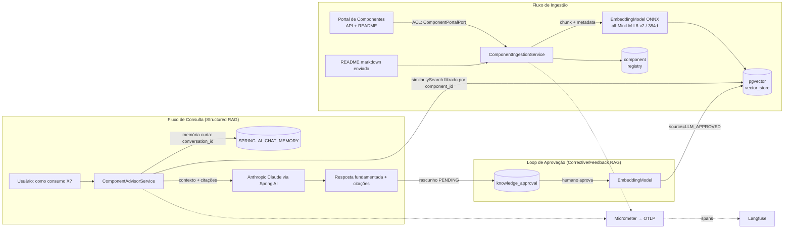

# PoC Agentic RAG — Component Advisor

Agente que ensina desenvolvedores a **consumir componentes internos** do portal.
Ele ingere as informações do componente (API + README), indexa no **pgvector**, e
responde "como implementar o consumo de X" com **citações das fontes**. Respostas
aprovadas por um humano viram base de conhecimento (loop _human-in-the-loop_).

> **Construção evolutiva/incremental.** Esta é a **Fase 1 (Structured RAG)**, já
> validada ponta a ponta. As fases 2–4 evoluem até o padrão _Agentic RAG_ sem jogar
> fora o que já existe. Veja [Roadmap](#roadmap-evolutivo).

**Stack:** Java 25 · Spring Boot 3.5 · Spring AI 1.0 · PostgreSQL + pgvector ·
Embeddings ONNX locais (all-MiniLM-L6-v2) · Anthropic Claude · Langfuse (OTLP).

---

## Status desta fase (verificado)

Rodado localmente contra Postgres+pgvector real e a app no perfil `mock`:

| Verificação | Resultado |
|---|---|
| `mvn compile` (Spring Boot 3.5.6 + Spring AI 1.0.1, Java 25) | ✅ BUILD SUCCESS |
| Flyway V1+V2 aplicadas no pgvector (PG 17) | ✅ extensões, `vector(384)`, HNSW, tabelas |
| Boot da app + health | ✅ `UP`, embeddings ONNX carregados |
| Ingestão do portal (`payments-sdk`) | ✅ 3 endpoints + 1 overview + 5 chunks README = 9 docs, 384 dims |
| Idempotência (re-ingest) | ✅ `skipped:true`, 0 docs |
| Busca ANN (HNSW/cosine) | ✅ ranking semanticamente coerente |
| Upload de README próprio | ✅ substitui fontes primárias, preserva o resto |
| `/advise` (LLM) + loop de aprovação | ⏳ requer `ANTHROPIC_API_KEY` (código compila; recuperação já provada) |

---

## Arquitetura (Fase 1)



### As duas memórias (deliberadamente separadas)

| | Curto prazo | Longo prazo |
|---|---|---|
| O quê | Histórico da conversa | Conhecimento sobre componentes |
| Onde | `SPRING_AI_CHAT_MEMORY` (JDBC) | `vector_store` (pgvector) |
| Como | `MessageWindowChatMemory` (janela de 20 msgs) | busca por similaridade (HNSW/cosine) |
| Chave | `conversation_id` | filtro `component_id` + `source` |

Misturar as duas polui a recuperação; por isso são tabelas e mecanismos distintos.

---

## Decisões de engenharia (o porquê)

- **Arquitetura hexagonal leve.** O portal é externo e instável → isolado atrás de
  `ComponentPortalPort` (Anti-Corruption Layer). Trocar o portal ou mockar em teste
  não toca o domínio. Na Fase 4 essa mesma _port_ vira uma _tool_ do agente.
- **Structured RAG, não "naive".** A fonte primária é uma API com contrato: cada
  endpoint vira um documento com **metadados filtráveis** (`kind`, `endpoint`,
  `version`), o que melhora precisão e permite filtro por componente.
- **Embeddings locais (ONNX/MiniLM, 384d).** A Anthropic **não tem API de embeddings**.
  Para PoC, embeddings locais = zero chave externa, reprodutível e barato. É
  _swappable_: trocar de modelo exige **migração da dimensão do vetor** (por isso a
  dimensão está no schema Flyway, não escondida).
- **pgvector + HNSW/cosine.** Estado da arte para ANN em Postgres; um só banco para
  vetores + dados relacionais + memória de conversa reduz operação na PoC.
- **Flyway com DDL explícito.** `initialize-schema` do Spring AI **desligado**: schema
  versionado e revisável, pronto para produção (nada de DDL mágico em runtime).
- **Anti-eco no loop HITL.** Só respostas **aprovadas** entram na base, marcadas
  `source=LLM_APPROVED` e com **precedência menor** que `PORTAL_API`/`README`. Reingerir
  um componente **apaga só as fontes primárias** e **preserva** o conhecimento aprovado.
- **Idempotência por hash.** Reingestão sem mudança de conteúdo não recomputa embeddings.
- **Java 25 + virtual threads.** O caminho é I/O-bound (portal + DB + LLM); virtual
  threads dão concorrência barata sem programação reativa.
- **Observabilidade nativa.** Spring AI emite spans (Micrometer) exportados via **OTLP**
  para o **Langfuse** — cada recuperação e chamada de LLM fica rastreável.
- **Segurança.** `component_id` é validado (`[A-Za-z0-9._-]+`) antes de entrar em filter
  expression do vector store (evita injeção no filtro).

---

## Como rodar

### Pré-requisitos
- Java 25 (testado com Amazon Corretto 25)
- Docker + Docker Compose
- Maven 3.9+ (ou use o IntelliJ, que gerencia o Maven pelo `pom.xml`)

### 1) Suba o Postgres + pgvector
```bash
docker compose up -d postgres
```

### 2) Configure o ambiente
```bash
cp .env.example .env   # edite ANTHROPIC_API_KEY (necessária só para /advise)
```
Exporte as variáveis ou rode via IDE. Para a Fase 1 sem portal real, use o perfil `mock`.

### 3) Rode a aplicação
```bash
# perfil mock: fornece o componente de exemplo "payments-sdk"
mvn -Dspring-boot.run.profiles=mock spring-boot:run
```
Na 1ª subida o modelo de embeddings ONNX é baixado (~50s).

### 4) Exercite o fluxo
```bash
# Ingerir componente (API + README) do portal
curl -X POST http://localhost:8080/api/v1/components/payments-sdk/ingest

# Ingerir usando um README próprio (arquivo markdown)
curl -X POST http://localhost:8080/api/v1/components/payments-sdk/ingest/readme \
  -H "Content-Type: text/markdown" --data-binary @CAMINHO/DO/README.md

# Perguntar como consumir (precisa de ANTHROPIC_API_KEY)
curl -X POST http://localhost:8080/api/v1/components/payments-sdk/advise \
  -H "Content-Type: application/json" \
  -d '{"question":"Como faço uma cobrança e trato idempotência?"}'

# Ver rascunhos pendentes e aprovar (vira base de conhecimento)
curl http://localhost:8080/api/v1/approvals/pending
curl -X POST http://localhost:8080/api/v1/approvals/{id}/approve \
  -H "Content-Type: application/json" -d '{"reviewer":"fernando","note":"ok"}'
```

### (Opcional) Langfuse
```bash
docker compose --profile observability up -d
# configure OTEL_EXPORTER_OTLP_ENDPOINT e OTEL_EXPORTER_OTLP_HEADERS (Basic base64(pk:sk))
```

---

## API

| Método | Rota | Descrição |
|---|---|---|
| POST | `/api/v1/components/{id}/ingest` | Ingere metadados + README do portal |
| POST | `/api/v1/components/{id}/ingest/readme` | Ingere com README enviado (text/markdown) |
| POST | `/api/v1/components/{id}/advise` | Pergunta como consumir; retorna resposta + citações |
| GET  | `/api/v1/approvals/pending` | Lista respostas aguardando aprovação |
| POST | `/api/v1/approvals/{id}/approve` | Aprova → indexa como conhecimento |
| POST | `/api/v1/approvals/{id}/reject` | Rejeita → descarta |

---

## Roadmap evolutivo

Cada fase entrega valor e reaproveita a anterior (mapeada aos 8 padrões de RAG):

- **Fase 1 — Structured RAG (#1).** ✅ Ingestão (API+README), pgvector, memória curta+longa,
  consulta com citações, loop HITL de aprovação.
- **Fase 2 — HyDE (#3) + busca híbrida.** Documento hipotético para melhorar recall;
  combinar denso (pgvector) + full-text/BM25 do Postgres; rerank por fonte.
- **Fase 3 — Corrective/Adaptive RAG (#4/#7).** _Self-grading_ da recuperação; roteador
  "precisa recuperar?"; fallback para chamar o portal ao vivo quando a base falha.
- **Fase 4 — Agentic RAG (#8).** Orquestrador + _tools_ via **MCP** (chamar a API do
  portal, validar snippet gerado, abrir ticket), planner e as duas memórias.

---

## Ajustes/decisões em aberto (precisam da sua confirmação)

1. **Provider de LLM/embeddings.** Default: Claude (chat) + ONNX local (embeddings).
   Se a empresa exige **Azure OpenAI**, é troca de _starter_ + config (o domínio não muda).
2. **Portal real.** O `RestClientComponentPortalAdapter` é um esqueleto — ajuste o
   mapeamento ao **OpenAPI** do seu portal (autenticação, caminhos, schema).
3. **Modelo de embeddings.** MiniLM (384d) é ótimo para PoC, mas é **focado em inglês** —
   os testes mostraram ranking fraco para consultas em **português** (chunks de README
   acima do endpoint certo). Para produção/PT avalie um modelo **multilíngue**
   (ex.: `paraphrase-multilingual-MiniLM-L12-v2`, 384d, mesma dimensão) ou hospedado.
   Isso motiva o **rerank da Fase 2**.

### Rodando os testes localmente
CI usa Testcontainers. Neste ambiente o Docker Engine 29.x responde 400 ao docker-java,
então rode os ITs contra o Postgres do compose:
```bash
docker compose up -d postgres
mvn -Dit.datasource.url=jdbc:postgresql://localhost:5432/ragdb \
    -Dit.datasource.username=rag -Dit.datasource.password=rag verify
```
