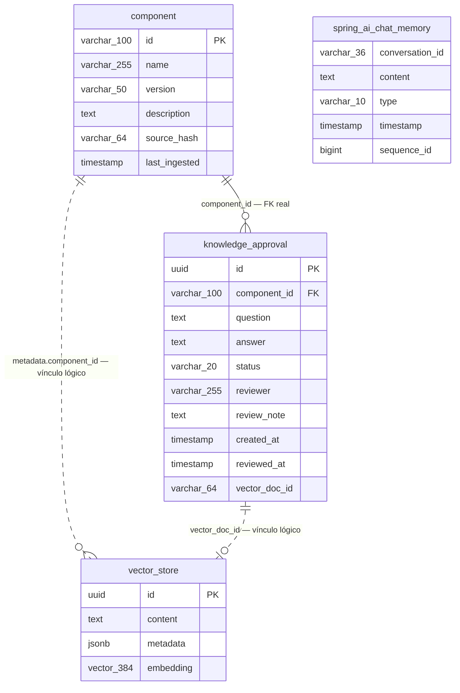

# Modelo de dados — PoC Agentic RAG

Descritivo de **todas as tabelas e campos** do banco da aplicação (`ragdb`), com o papel de
cada coluna no fluxo de ingestão, recuperação e aprovação humana.

- **SGBD:** PostgreSQL 17 + [`pgvector`](https://github.com/pgvector/pgvector) (imagem `pgvector/pgvector:pg17`).
- **Origem do schema:** DDL explícito versionado em [`src/main/resources/db/migration`](../src/main/resources/db/migration),
  aplicado pelo **Flyway** no boot. As criações automáticas do Spring AI estão **desligadas**
  (`spring.ai.vectorstore.pgvector.initialize-schema: false` e
  `spring.ai.chat.memory.repository.jdbc.initialize-schema: never`) — nada de DDL mágico em runtime.
- **Migrações atuais:** `V1` (extensões + vector store + chat memory), `V2` (registro de
  componentes + fila de aprovação), `V3` (`sequence_id` na chat memory).

---

## 1. Visão geral

| Tabela | Origem | Papel | Quem escreve |
|---|---|---|---|
| [`vector_store`](#3-vector_store) | Spring AI (`PgVectorStore`) | **Memória de longo prazo**: base de conhecimento vetorial (chunks + embeddings) | `ComponentIngestionService`, `KnowledgeApprovalService` |
| [`spring_ai_chat_memory`](#4-spring_ai_chat_memory) | Spring AI (`JdbcChatMemoryRepository`) | **Memória de curto prazo**: histórico da conversa | `MessageWindowChatMemory` (janela de 20 mensagens) |
| [`component`](#5-component) | Domínio da aplicação | Catálogo do que já foi ingerido — idempotência, auditoria e **moldura de escopo** do M04 | `ComponentRegistryRepository` |
| [`knowledge_approval`](#6-knowledge_approval) | Domínio da aplicação | Fila **HITL**: respostas da LLM aguardando revisão humana | `KnowledgeApprovalRepository` |
| [`flyway_schema_history`](#7-flyway_schema_history) | Flyway | Controle de versão do schema (infraestrutura) | Flyway |

As duas memórias são **deliberadamente separadas** — misturar histórico de conversa com
conhecimento sobre componentes polui a recuperação:

| | Curto prazo | Longo prazo |
|---|---|---|
| O quê | Histórico da conversa | Conhecimento sobre componentes |
| Onde | `spring_ai_chat_memory` | `vector_store` |
| Como | janela deslizante de 20 mensagens | busca por similaridade (HNSW/cosseno) |
| Chave | `conversation_id` | filtro por `component_id` + `source` |

### Extensões exigidas

| Extensão | Para quê |
|---|---|
| `vector` | tipo `vector(384)` e índice HNSW da `vector_store` |
| `uuid-ossp` | `uuid_generate_v4()` nos defaults de `vector_store.id` e `knowledge_approval.id` |

---

## 2. Diagrama de relacionamentos



`spring_ai_chat_memory` aparece **solta de propósito**: a conversa não referencia componente
nem aprovação — a chave é o `conversation_id` que o cliente devolve a cada `/advise`.

---

## 3. `vector_store`

**Memória de longo prazo.** Um registro por *chunk* indexado. A estrutura é a esperada pelo
`PgVectorStore` do Spring AI; o DDL é nosso (migração `V1`).

| Campo | Tipo | Nulo | Padrão | Descrição |
|---|---|---|---|---|
| `id` | `uuid` | não (**PK**) | `uuid_generate_v4()` | Identificador do chunk. Na prática é **gerado pela aplicação** (`Document.getId()`) e enviado no insert — o default do banco só vale para inserção manual. É este valor que `knowledge_approval.vector_doc_id` guarda quando um Q&A é aprovado. |
| `content` | `text` | sim¹ | — | Texto do chunk, **já sanitizado** pelo `IngestionGuard` (M04). É o que vai para o contexto da LLM (limitado a 2 000 caracteres por fonte) e o que gera o *snippet* de exibição (600 caracteres). |
| `metadata` | `jsonb` | sim¹ | — | Metadados filtráveis do chunk — ver [3.1](#31-chaves-de-metadata). Sustentam o filtro por componente, o *rerank* por fonte e o rótulo das citações. |
| `embedding` | `vector(384)` | sim¹ | — | Vetor denso do `content`. **384 dimensões fixas** no schema (ver [3.3](#33-por-que-384-dimensões)). |

¹ Nulo permitido no DDL (contrato do Spring AI), mas a aplicação sempre preenche os três.

### 3.1 Chaves de `metadata`

O JSONB não tem schema imposto pelo banco; quem o define é o código de ingestão/aprovação.
As chaves gravadas hoje:

| Chave | Presente em | Valores | Descrição |
|---|---|---|---|
| `source` | **todos** | `PORTAL_API`, `README`, `LLM_APPROVED` | Origem do chunk (`KnowledgeSource`). Governa a **precedência**: fontes primárias vencem o conhecimento aprovado em caso de conflito, e a reingestão apaga só as primárias. |
| `component_id` | **todos** | ex.: `payments-sdk` | Componente dono do chunk. É o **filtro da recuperação** (`component_id == '...'`) — por isso o valor é validado contra `[A-Za-z0-9._-]+` antes de entrar na *filter expression*. |
| `kind` | **todos** | `overview`, `endpoint`, `readme`, `qa` | Tipo do documento — ver [3.2](#32-tipos-de-documento-kind). |
| `component_name` | `kind=overview` | ex.: `Payments SDK` | Nome legível do componente. |
| `version` | `overview`, `endpoint`, `readme` | ex.: `2.3.0` | Versão do componente **no momento da ingestão**. Ausente em `kind=qa`. |
| `endpoint` | `kind=endpoint` | ex.: `POST /v2/charges` | Método + caminho. Vira o rótulo da citação e alimenta o *rerank* léxico por título. |
| `section` | `kind=readme` | ex.: `Idempotência` | Título da seção `##`/`###` do markdown (`Introdução` para o texto antes do primeiro título). A citação é exibida como `README > Idempotência`. |
| `approved_by` | `kind=qa` | revisor, ou `unknown` | Quem aprovou o Q&A no fluxo HITL. |

### 3.2 Tipos de documento (`kind`)

| `kind` | `source` | Origem | Um registro por | Metadados adicionais |
|---|---|---|---|---|
| `overview` | `PORTAL_API` | Metadados estruturados do portal (nome, descrição, tags, repositório) | componente | `component_name`, `version` |
| `endpoint` | `PORTAL_API` | Contrato de cada endpoint (método, caminho, auth, request/response) | endpoint | `version`, `endpoint` |
| `readme` | `README` | README markdown, quebrado por seção (teto de 1 200 caracteres) | seção/parágrafo | `version`, `section` |
| `qa` | `LLM_APPROVED` | Pergunta + resposta aprovada no HITL | aprovação | `approved_by` |

### 3.3 Por que 384 dimensões

A coluna é `vector(384)` — dimensão do `all-MiniLM-L6-v2`/`paraphrase-multilingual-MiniLM-L12-v2`
e também do `text-embedding-3-small` **encurtado** via `dimensions: 384` (Matryoshka). Trocar o
*backend* de embedding não exigiu migração de coluna, mas **sempre exige reingestão**: vetores de
modelos diferentes não são comparáveis, mesmo com a mesma dimensão. Quem força isso é o
`app.embedding.model-id`, que entra no hash de idempotência (ver [`component.source_hash`](#5-component)).
Mudar a **dimensão**, aí sim, pede nova migração.

### 3.4 Índices

| Índice | Definição | Para quê |
|---|---|---|
| PK | `id` | Chave primária |
| `vector_store_hnsw_idx` | `USING hnsw (embedding vector_cosine_ops)` | Busca ANN por similaridade de cosseno |
| `vector_store_metadata_gin_idx` | `USING gin (metadata)` | Filtro por `component_id`/`source` (*namespacing*) |

---

## 4. `spring_ai_chat_memory`

**Memória de curto prazo.** Uma linha por mensagem da conversa. Criada como
`SPRING_AI_CHAT_MEMORY` no DDL — sem aspas, o PostgreSQL normaliza para **minúsculas**, então o
nome real no catálogo é `spring_ai_chat_memory`. Estrutura alinhada ao
`schema-postgresql.sql` do módulo `chat-memory-repository-jdbc` 2.0.0.

| Campo | Tipo | Nulo | Padrão | Descrição |
|---|---|---|---|---|
| `conversation_id` | `varchar(36)` | não | — | Identificador da conversa (UUID em texto). Vem do cliente no `/advise`; se ausente, a aplicação gera um e o devolve na resposta. |
| `content` | `text` | não | — | Corpo da mensagem. Do lado do usuário é a pergunta **já sanitizada** pelo `InputGuard` — o dado mascarado não entra na memória. |
| `type` | `varchar(10)` | não | — | Papel da mensagem. `CHECK` restringe a `USER`, `ASSISTANT`, `SYSTEM`, `TOOL`. |
| `timestamp` | `timestamp` | não | — | Momento da mensagem. **Nome entre aspas no DDL** (`"timestamp"`) porque colide com nome de tipo SQL — consultas manuais precisam citá-lo da mesma forma. |
| `sequence_id` | `bigint` | não | — | Ordem determinística da mensagem **dentro da conversa**, 0-based. Adicionado na `V3`: o Spring AI 2.0 deixou de depender do `timestamp` para ordenar (dois eventos no mesmo milissegundo saíam fora de ordem). A `V3` faz *backfill* das linhas antigas por `ROW_NUMBER()` antes de aplicar o `NOT NULL`. |

**Sem chave primária** — é o contrato do Spring AI. A chave *lógica* é
`(conversation_id, sequence_id)`, e nenhum código nosso escreve nesta tabela: quem grava e poda
é o `JdbcChatMemoryRepository`, através do `MessageWindowChatMemory` configurado em
`MemoryConfig` com janela de **20 mensagens**.

### Índices

| Índice | Definição | Para quê |
|---|---|---|
| `spring_ai_chat_memory_conversation_id_timestamp_idx` | `(conversation_id, "timestamp")` | Leitura cronológica (caminho pré-`V3`) |
| `spring_ai_chat_memory_conversation_id_sequence_id_idx` | `(conversation_id, sequence_id)` | Leitura ordenada determinística (caminho atual) |

---

## 5. `component`

**Catálogo do que já foi ingerido.** Uma linha por componente. Dá idempotência e auditoria à
ingestão — e é também a fonte da "moldura de escopo" que o juiz do M04 usa para decidir se uma
pergunta está dentro do domínio.

| Campo | Tipo | Nulo | Padrão | Descrição |
|---|---|---|---|---|
| `id` | `varchar(100)` | não (**PK**) | — | Id do componente **no portal** (ex.: `payments-sdk`). É o mesmo valor que aparece em `vector_store.metadata->>'component_id'` e na URL da API. Validado contra `[A-Za-z0-9._-]+` antes de virar filtro do vector store. |
| `name` | `varchar(255)` | não | — | Nome legível. Entra no resumo `nome: descrição` que alimenta o juiz de escopo. |
| `version` | `varchar(50)` | sim | — | Versão ingerida. Também é copiada para o `metadata` dos chunks. |
| `description` | `text` | sim | — | Descrição vinda do portal. Segunda metade do resumo do juiz de escopo. |
| `source_hash` | `varchar(64)` | sim | — | **SHA-256 (hex, 64 chars)** de `app.embedding.model-id` + o texto de **todos os documentos já sanitizados**. É a chave da idempotência: hash igual ⇒ ingestão pulada sem recomputar embeddings. Como o hash é do conteúdo *pós*-guardrail, endurecer a política de segurança também força a reingestão. |
| `last_ingested` | `timestamp` | não | `now()` | Momento da última ingestão efetiva (atualizado no `INSERT ... ON CONFLICT DO UPDATE`). |

O acesso é sempre por `upsert` (`ON CONFLICT (id) DO UPDATE`) — reingerir sobrescreve nome,
versão, descrição e hash, e reposiciona `last_ingested`.

---

## 6. `knowledge_approval`

**Fila human-in-the-loop.** Uma linha por resposta gerada pela LLM. Só o que for `APPROVED`
vira chunk na base vetorial — é a salvaguarda contra realimentação/eco do próprio modelo.

| Campo | Tipo | Nulo | Padrão | Descrição |
|---|---|---|---|---|
| `id` | `uuid` | não (**PK**) | `uuid_generate_v4()` | Identificador da aprovação. Gerado pela aplicação (`UUID.randomUUID()`) e devolvido no `/advise` como `approvalId`. |
| `component_id` | `varchar(100)` | não (**FK** → `component.id`) | — | Componente da pergunta. **Única chave estrangeira real do schema** — ver [8](#8-integridade-o-que-é-fk-e-o-que-é-vínculo-lógico). |
| `question` | `text` | não | — | Pergunta do usuário **já sanitizada** pelo `InputGuard`: o que foi mascarado na entrada não chega ao rascunho. |
| `answer` | `text` | não | — | Resposta da LLM **já sanitizada** pelo `OutputGuard`. Resposta vazia não vira rascunho (o `/advise` registra `rag.empty_answer` em vez de gravar). |
| `status` | `varchar(20)` | não | `'PENDING'` | Estado do fluxo. `CHECK` restringe a `PENDING`, `APPROVED`, `REJECTED`. As transições só saem de `PENDING` (`WHERE ... AND status = 'PENDING'` nos updates). |
| `reviewer` | `varchar(255)` | sim | — | Quem revisou. Preenchido na aprovação/rejeição; copiado para `metadata.approved_by` do chunk quando aprovado (`unknown` se não informado). |
| `review_note` | `text` | sim | — | Observação livre do revisor. |
| `created_at` | `timestamp` | não | `now()` | Criação do rascunho. Ordena a listagem de pendentes (`ORDER BY created_at DESC`). |
| `reviewed_at` | `timestamp` | sim | — | Momento da revisão. `NULL` enquanto `PENDING`. |
| `vector_doc_id` | `varchar(64)` | sim | — | `vector_store.id` do chunk gerado na aprovação — a ponte entre a fila e a base indexada. `NULL` para `PENDING` e `REJECTED`. Guardado como texto; um `JOIN` com `vector_store` precisa de *cast* (`::uuid`). |

### Ciclo de vida

```
/advise  ──► PENDING ──┬── approve ──► APPROVED  + chunk (source=LLM_APPROVED) + vector_doc_id
                       └── reject  ──► REJECTED  (nada é indexado)
```

A aprovação é **transacional** e recusa resposta vazia — um Q&A vazio indexado ranqueia e não
entrega nada, envenenando a recuperação.

### Índices

| Índice | Definição | Para quê |
|---|---|---|
| PK | `id` | Chave primária |
| `knowledge_approval_status_idx` | `(status)` | Listagem da fila de pendentes |
| `knowledge_approval_component_idx` | `(component_id)` | Histórico por componente |

---

## 7. `flyway_schema_history`

Tabela de infraestrutura criada e mantida pelo **próprio Flyway** (`spring.flyway.enabled: true`,
`baseline-on-migrate: true`) — não faz parte do domínio e não deve ser editada à mão. Guarda uma
linha por migração aplicada, com versão, descrição, *checksum*, autor, data e duração. É o que
faz o boot saber que `V1`–`V3` já rodaram.

---

## 8. Integridade: o que é FK e o que é vínculo lógico

| Ligação | Tipo | Consequência prática |
|---|---|---|
| `knowledge_approval.component_id` → `component.id` | **FK real** | Um rascunho HITL só pode ser gravado para um componente **já ingerido** — é a ingestão que cria a linha em `component`. Não há `ON DELETE`: apagar um componente com aprovações falha por violação de FK. |
| `vector_store.metadata->>'component_id'` → `component.id` | Lógico | O vector store é uma tabela do Spring AI com metadados em JSONB; o banco não valida a referência. Apagar uma linha de `component` **não** remove os chunks — a limpeza é feita pelo `vectorStore.delete(...)` da reingestão. |
| `knowledge_approval.vector_doc_id` → `vector_store.id` | Lógico | Tipos diferentes (`varchar(64)` × `uuid`) e sem FK: um chunk removido deixa o ponteiro pendurado. |

**Reingestão preserva conhecimento aprovado.** O `delete` da reingestão é filtrado por
`component_id == X && source != 'LLM_APPROVED'`: as fontes primárias são substituídas, os Q&As
aprovados permanecem.

---

## 9. O que **não** é persistido em tabela

Para não procurar o que não existe:

| Dado | Onde vive |
|---|---|
| **CSAT** (👍/👎 do `/feedback`) | Só métrica Micrometer (`rag.csat`) + evento no *trace*. Não há tabela de feedback. |
| SLIs de latência, tokens, custo, decisões de guardrail | Métricas Micrometer → Prometheus (`/actuator/prometheus`). |
| *Traces* de recuperação e chamada de LLM | OTLP → Langfuse. |
| Catálogo de modelos, política de segurança, roteamento por risco | `application.yml` (config versionada). |
| *Golden set* e datasets de segurança | CSV no classpath (`golden/`, `security/`). |
| Chaves de provedores de LLM | Só no proxy LiteLLM — a aplicação nunca vê credencial de vendor. |

---

## 10. Consultas úteis

```sql
-- O que já foi ingerido, e quando
SELECT id, name, version, last_ingested, left(source_hash, 12) AS hash
  FROM component
 ORDER BY last_ingested DESC;

-- Composição da base por componente e origem
SELECT metadata->>'component_id' AS componente,
       metadata->>'source'       AS origem,
       metadata->>'kind'         AS tipo,
       count(*)                  AS chunks
  FROM vector_store
 GROUP BY 1, 2, 3
 ORDER BY 1, 2, 3;

-- Endpoints indexados de um componente
SELECT metadata->>'endpoint' AS endpoint, metadata->>'version' AS versao
  FROM vector_store
 WHERE metadata->>'component_id' = 'payments-sdk'
   AND metadata->>'kind' = 'endpoint'
 ORDER BY 1;

-- Fila HITL pendente
SELECT id, component_id, left(question, 80) AS pergunta, created_at
  FROM knowledge_approval
 WHERE status = 'PENDING'
 ORDER BY created_at DESC;

-- Aprovações e o chunk que cada uma gerou (cast obrigatório: varchar × uuid)
SELECT ka.id, ka.component_id, ka.reviewer, ka.reviewed_at,
       vs.metadata->>'approved_by' AS aprovado_por
  FROM knowledge_approval ka
  LEFT JOIN vector_store vs ON vs.id = ka.vector_doc_id::uuid
 WHERE ka.status = 'APPROVED'
 ORDER BY ka.reviewed_at DESC;

-- Histórico de uma conversa, na ordem determinística
SELECT sequence_id, type, "timestamp", left(content, 120) AS trecho
  FROM spring_ai_chat_memory
 WHERE conversation_id = '<uuid-da-conversa>'
 ORDER BY sequence_id;
```

---

## 11. Impacto de mudanças no schema

| Mudança pretendida | O que ela exige |
|---|---|
| Trocar o **modelo de embedding** (mesma dimensão) | Nova `app.embedding.model-id` ⇒ o hash muda e a reingestão acontece sozinha. Sem migração. |
| Trocar para um modelo de **outra dimensão** | Nova migração alterando `vector(384)` + recriação do índice HNSW + reingestão total. |
| Novo metadado nos chunks | Nenhuma migração (JSONB), mas documente a chave na seção [3.1](#31-chaves-de-metadata) — o índice GIN já cobre a filtragem. |
| Novo estado de aprovação | Alterar o `CHECK` de `knowledge_approval.status` em nova migração **e** o enum `ApprovalStatus`. |
| Novo tipo de mensagem na memória | Alterar o `CHECK` de `spring_ai_chat_memory.type` — o conjunto atual é o contrato do Spring AI. |

> Migrações já aplicadas **não se editam**: o Flyway valida o *checksum* contra
> `flyway_schema_history` e o boot falha. Toda mudança é uma migração `V4+` nova.
